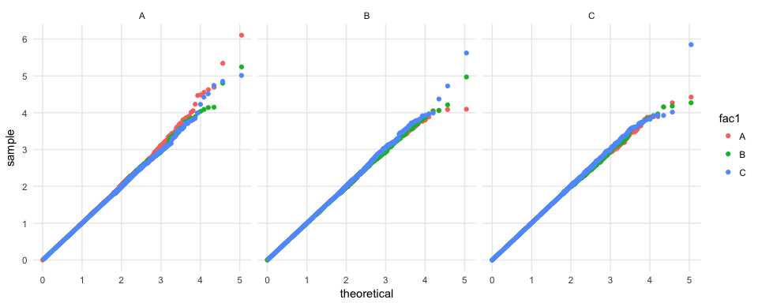

<!-- README.md is generated from README.Rmd. Please edit that file -->
gg\_QQ\_unif
============

ggbigQQ extends `ggplot2` to allow the user to make a quantile-quantile plot with a big dataset. Specifically, `geom_big_qq` uses all the data provided to calculate quantiles, but drops points that would overplot before plotting. <!-- There's no use in having ten thousand points in a plot to define a line -- we can't even see most of them! --> In this way, the resultant figure maintains all the accuracy of a Q-Q plot made with a large dataset, but renders as fast as one from a smaller dataset and, when stored as a vector graphic, has the file size of a Q-Q plot from a smaller dataset.

Examples
--------

Here's an example where `geom_qq` takes 14 seconds to render the plot on my intel i5 and `geom_big_qq` takes 1 second to produce the same plot.

``` r
set.seed(27599)
d <- data.frame(s = runif(n = 5e5))

# # takes 14 seconds
# d %>%
#   ggplot(mapping = aes(sample = s)) +
#   geom_qq(distribution = qunif) +
#   QQ_scale_x() +
#   QQ_scale_y()


# takes 1 second
d %>%
  ggplot(mapping = aes(sample = s)) +
  geom_QQ_unif() +
  scale_x_QQ() +
  scale_y_QQ() +
  theme_minimal()
```


This `geom` works with other aesthetics, too.

``` r
set.seed(27599)
n <- 5e5
d <- data.frame(fac1 = sample(x = LETTERS[1:3], size = n, replace = TRUE),
                fac2 = sample(x = LETTERS[1:3], size = n, replace = TRUE),
                s = runif(n = n))

# takes 1 second
d %>%
  ggplot(mapping = aes(sample = s, color = fac1)) +
  geom_QQ_unif() +
  facet_wrap(~ fac2) +
  scale_x_QQ() +
  scale_y_QQ() +
  theme_minimal()
```


